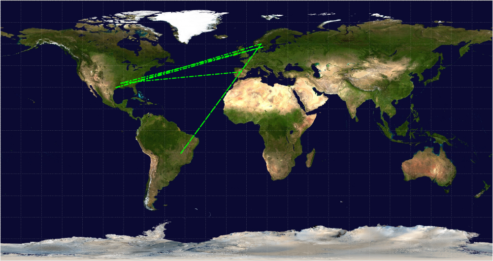
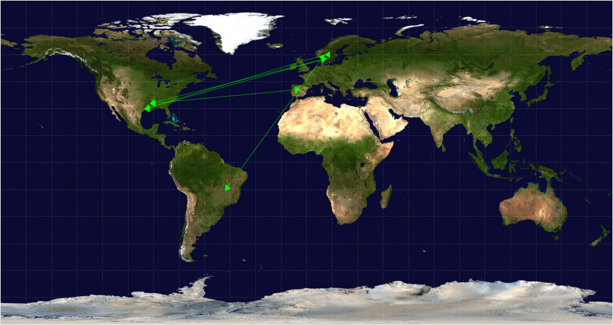

# 🌍 GeoTrace
Plots a traceroute path on a map. 

  
  
  

Made with <a href="https://www.qt.io/">Qt</a>!

## Features

* Draw with or without orange markers.
* Draw with or without green lines.
* Export map as image (png / jpg).
* Export GPS path.
* Export x, y path.
* Export traceroute output.

## Usage

Create an enviorment variable, `tr_api_key`, with a key from https://ipgeolocation.io/.

## About

This program was made in the span of a week as one of my side projects during the summer.

Watching the development of <a href="https://github.com/SerenityOS/serenity">SerenityOS</a> made me want to give C++ another try.

## Options

There are a couple optional ways to draw the map:

Lines                   |Arrows                   | Markers
:----------------------:|:-----------------------:|:-------------------------:|
|||

## Todo

* Make GUI elements responsive.
* Fix random crashes.
* Better design / styling.
* Interactive map.
* Make short paths easier to see
  * Either with interactive map or zooming. 
